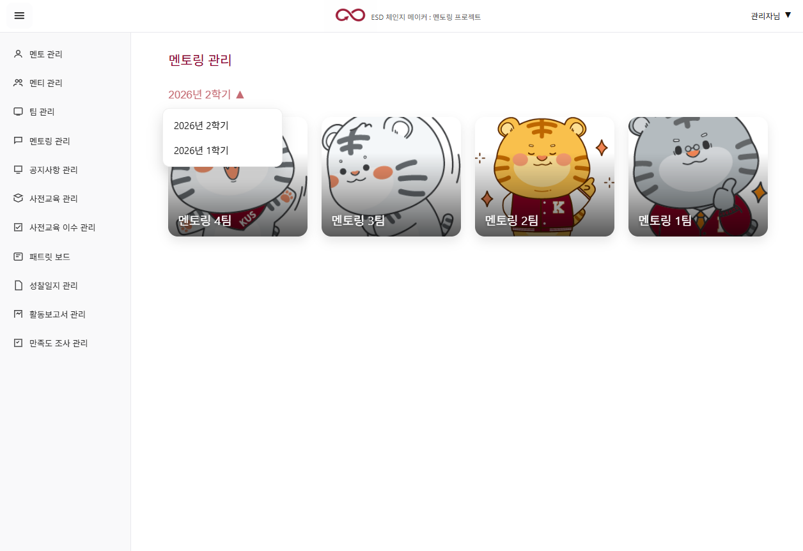
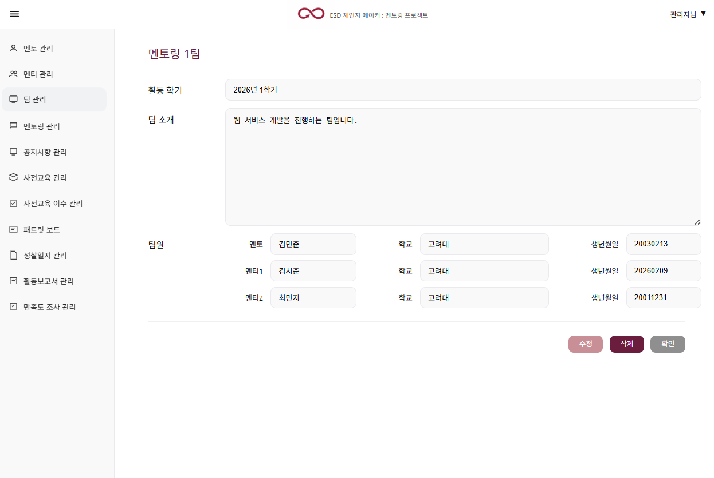
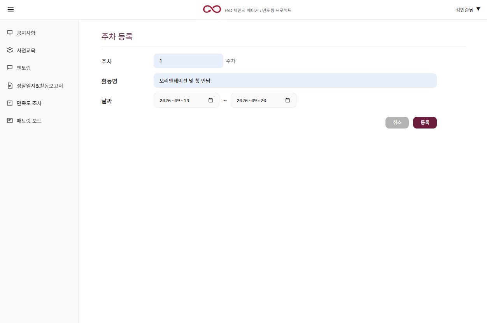
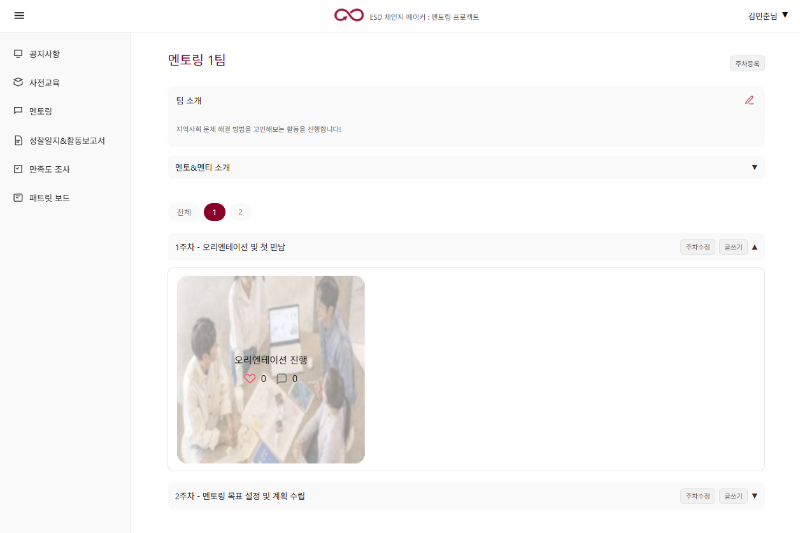
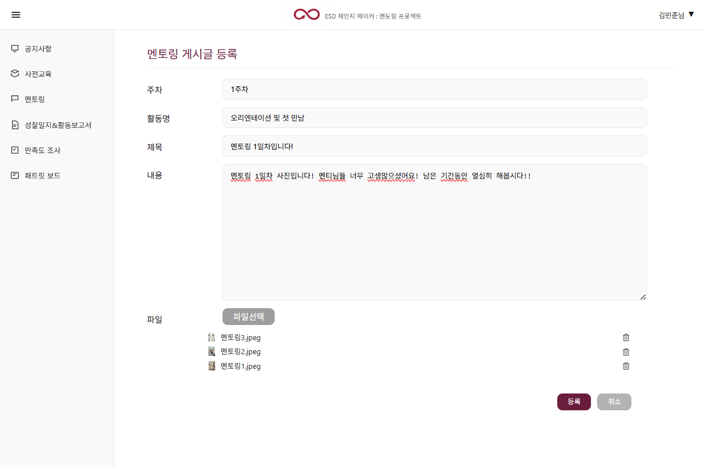

# ESD 체인지 메이커 : 멘토링 프로젝트

<!-- 대표 화면 이미지 또는 GIF -->

> 멘토링 프로그램의 팀 구성부터 주차별 활동 및 멘토링 기록까지  
> 하나의 시스템에서 관리할 수 있도록 개발한 웹 기반 멘토링 관리 플랫폼입니다.

<br>

## 배포 링크

🔗 [http://mmt2026.cafe24.com/](http://mmt2026.cafe24.com/)

> 본 프로젝트는 HTTP 환경으로 배포되어 있습니다.  
> 접속이 원활하지 않을 경우 주소가 `http://`로 설정되어 있는지 확인해 주세요.

<br>

## 목차

- [1. 프로젝트 개요](#1-프로젝트-개요)
- [2. 기술 스택](#2-기술-스택)
- [3. ERD](#3-erd)
- [4. 전체 기능](#4-전체-기능)
- [5. 주요 기능 상세](#5-주요-기능-상세)
- [6. 백엔드 핵심 설계](#6-백엔드-핵심-설계)
- [7. 프로젝트 구조](#7-프로젝트-구조)
- [8. Troubleshooting](#8-troubleshooting)

<br>

---

# 1. 프로젝트 개요

## 프로젝트 소개

기존 멘토링 프로그램에서 **수기 및 분산된 방식으로 관리되던 팀 정보, 주차별 활동 일정, 멘토링 활동 기록** 등을 하나의 시스템에서 관리할 수 있도록 개발한 웹 기반 플랫폼입니다.

관리자는 전체 멘토링 팀을 관리할 수 있으며, 멘토와 멘티는 자신이 소속된 팀을 중심으로 주차별 활동을 확인하고 멘토링 기록을 작성할 수 있도록 구현했습니다.

본 프로젝트는 **멘토링 운영 시스템의 기획·설계를 중심으로 진행**했으며, 전체 요구사항을 바탕으로 데이터 구조를 설계하고 주요 기능을 구현하여 설계 결과를 구체화했습니다.

<br>

### 개발 목적

기존 멘토링 프로그램에서 **수기로 관리하던 팀 구성, 주차별 활동 및 멘토링 기록을 웹 기반 시스템으로 전환**하여 운영 및 기록 관리의 효율성을 높이는 것을 목표로 개발했습니다.

- 수기 중심의 멘토링 운영 방식 시스템화
- 팀 및 멘토·멘티 정보의 통합 관리
- 연도·학기 및 주차별 활동 관리
- 멘토링 활동 기록의 온라인 작성 및 관리
- 사용자 권한에 따른 관리 및 조회 범위 구분
<br>

### 프로젝트 정보

| 구분 | 내용 |
| --- | --- |
| **개발 기간** | 2026.01.08 ~ 2026.02.19 |
| **팀원** | 3명 |
| **프로젝트 형태** | 팀 프로젝트 |
| **담당 역할** | UI/UX 설계 참여, DB 설계 및 Frontend·Backend 개발 전담 |

<br>

### 담당 역할

> **UI/UX 설계 공동 참여 · DB 설계 및 프론트엔드·백엔드 개발 전담**

**Backend / Database**

- Oracle 기반 **데이터베이스 및 테이블 관계 설계**
- 연도·학기별 **멘토링 팀 조회 및 관리 기능** 구현
- **팀원 및 주차별 활동 관리 기능** 구현
- **멘토링 활동 게시글 CRUD** 구현
- **다중 첨부파일 업로드 및 관리 기능** 구현
- Ajax 기반 **댓글 등록·조회·삭제 기능** 구현
- 게시글 **반응 등록·변경·취소 기능** 구현

**Frontend**

- JSP / HTML / CSS 기반 **전체 화면 구현**
- JavaScript / jQuery / Ajax를 활용한 **동적·비동기 기능 구현**
- 모바일 환경을 고려한 **반응형 화면 구현**

<br>

---

# 2. 기술 스택

### Backend
`Java` · `Spring Framework` · `Spring MVC` · `MyBatis`

### Frontend
`JSP` · `JSTL` · `HTML5` · `CSS3` · `JavaScript` · `jQuery` · `Ajax`

### Database
`Oracle`

### Tools
`STS` · `Apache Tomcat` · `SQL Developer`


<br>

---

# 3. ERD

> 멘토링 프로그램의 전체 요구사항을 바탕으로 사용자·팀·주차를 중심으로
멘토링 운영에 필요한 데이터 구조를 설계했습니다.

<br>

**주요 데이터 구조**

- `TBL_USER`를 중심으로 사용자와 프로그램 활동 데이터 연결
- `TBL_TEAM` · `TBL_TEAM_MEMBER` · `TBL_WEEKLY`를 통해 팀 구성과 주차별 활동 관리
- 멘토링 활동·활동일지·성찰일지의 첨부파일·댓글·반응 데이터를 별도 테이블로 분리

```mermaid
erDiagram

    TBL_USER {
        VARCHAR2 USER_ID PK
        VARCHAR2 USER_PW
        VARCHAR2 NAME
        VARCHAR2 PHONE
        VARCHAR2 EMAIL1
        DATE JUMIN
        CHAR AUTHORITY
        VARCHAR2 SCHOOL
        DATE REG_DATE
        VARCHAR2 EMAIL2
        NUMBER GRADE
    }

    TBL_TEAM {
        NUMBER TEAM_NUM PK
        VARCHAR2 TEAM_NAME
        NUMBER YEAR
        NUMBER TERM
        VARCHAR2 USER_ID FK
        DATE REG_DATE
        VARCHAR2 INTRO
    }

    TBL_TEAM_MEMBER {
        VARCHAR2 USER_ID PK,FK
        NUMBER TEAM_NUM PK,FK
        CHAR PART
    }

    TBL_WEEKLY {
        NUMBER WEEKLY_NUM PK
        DATE START_DATE
        DATE END_DATE
        VARCHAR2 USER_ID FK
        DATE REG_DATE
        VARCHAR2 ACTIVITY_NAME
        NUMBER TEAM_NUM FK
        NUMBER WEEK_NAME
    }

    TBL_MENTORING {
        NUMBER MENTORING_NUM PK
        VARCHAR2 TITLE
        VARCHAR2 CONTENT
        DATE REG_DATE
        NUMBER VIEW_COUNT
        NUMBER TEAM_NUM FK
        VARCHAR2 USER_ID FK
        NUMBER WEEKLY_NUM FK
    }

    TBL_MENTORING_COMT {
        NUMBER COMT_NUM PK
        VARCHAR2 CONTENT
        DATE REG_DATE
        NUMBER MENTORING_NUM FK
        VARCHAR2 USER_ID FK
    }

    TBL_MENTORING_FILE {
        NUMBER FILE_NUM PK
        VARCHAR2 FILE_NAME
        NUMBER MENTORING_NUM FK
    }

    TBL_MENTORING_RELATE {
        NUMBER RELATE_NUM PK
        CHAR RELATE_TYPE
        DATE REG_DATE
        NUMBER MENTORING_NUM FK
        VARCHAR2 USER_ID FK
    }

    TBL_ACTIVITY {
        NUMBER ACT_NUM PK
        DATE REG_DATE
        VARCHAR2 USER_ID FK
        NUMBER TEAM_NUM FK
        CHAR CATEGORY
        VARCHAR2 CONTENT
        VARCHAR2 SUBJECT
        DATE ACT_DATE
        VARCHAR2 PLACE
        NUMBER INWON
        VARCHAR2 OBJECTIVE
        VARCHAR2 REFERENCE
    }

    TBL_ACTIVITY_COMT {
        NUMBER ACT_NUM FK
        VARCHAR2 USER_ID FK
        NUMBER COMT_NUM PK
        VARCHAR2 CONTENT
        DATE REG_DATE
    }

    TBL_ACTIVITY_FILE {
        NUMBER FILE_NUM PK
        VARCHAR2 FILE_NAME
        NUMBER ACT_NUM FK
    }

    TBL_ACTIVITY_RELATE {
        NUMBER ACT_NUM FK
        VARCHAR2 USER_ID FK
        NUMBER RELATE_NUM PK
        CHAR RELATE_TYPE
        DATE REG_DATE
    }

    TBL_NOTICE {
        NUMBER NOTICE_NUM PK
        VARCHAR2 TITLE
        VARCHAR2 CONTENT
        DATE REG_DATE
        NUMBER VIEW_COUNT
        CHAR CATEGORY
        VARCHAR2 USER_ID FK
        NUMBER YEAR
        NUMBER TERM
    }

    TBL_NOTICE_FILE {
        NUMBER FILE_NUM PK
        VARCHAR2 FILE_NAME
        NUMBER NOTICE_NUM FK
    }

    TBL_PATRIT {
        NUMBER PATRIT_NUM PK
        VARCHAR2 CONTENT
        DATE REG_DATE
        VARCHAR2 USER_ID FK
        NUMBER TEAM_NUM FK
    }

    TBL_PATRIT_RELATE {
        NUMBER RELATE_NUM PK
        DATE REG_DATE
        NUMBER PATRIT_NUM FK
        VARCHAR2 USER_ID FK
    }

    TBL_PRETRAINING {
        NUMBER PRE_NUM PK
        VARCHAR2 TITLE
        VARCHAR2 CONTENT
        DATE REG_DATE
        CHAR CATEGORY
        VARCHAR2 USER_ID FK
        NUMBER VIEW_COUNT
        CHAR STATUS
    }

    TBL_PRETRAINING_COMPLETE {
        NUMBER COM_NUM PK
        DATE START_TIME
        DATE END_TIME
        CHAR STATUS
        NUMBER PRE_NUM FK
        VARCHAR2 USER_ID FK
    }

    TBL_PRETRAINING_FILE {
        NUMBER FILE_NUM PK
        VARCHAR2 FILE_NAME
        NUMBER PRE_NUM FK
    }

    TBL_REFLEC {
        NUMBER REFLEC_NUM PK
        DATE REG_DATE
        VARCHAR2 USER_ID FK
        NUMBER TEAM_NUM FK
        VARCHAR2 CATEGORY
        VARCHAR2 QUESTION1
        VARCHAR2 ACT_TOPIC
        CHAR ATTAINMENT
        VARCHAR2 ACT_PURPOSE
        VARCHAR2 OUTCOME
        VARCHAR2 QUESTION2
        VARCHAR2 QUESTION3
        VARCHAR2 QUESTION4
        VARCHAR2 QUESTION5
        NUMBER WEEKLY_NUM FK
    }

    TBL_REFLEC_COMT {
        NUMBER REFLEC_NUM FK
        VARCHAR2 USER_ID FK
        NUMBER COMT_NUM PK
        VARCHAR2 CONTENT
        DATE REG_DATE
    }

    TBL_REFLEC_FILE {
        NUMBER FILE_NUM PK
        VARCHAR2 FILE_NAME
        NUMBER REFLEC_NUM FK
    }

    TBL_REFLEC_RELATE {
        NUMBER REFLEC_NUM FK
        VARCHAR2 USER_ID FK
        NUMBER RELATE_NUM PK
        CHAR RELATE_TYPE
        DATE REG_DATE
    }

    TBL_SURVEY_QUESTION {
        NUMBER QUESTION_NUM PK
        VARCHAR2 TITLE
        NUMBER ORDER_NO
        CHAR ANSWER_TYPE
        CHAR USER_TYPE
        CHAR QUESTION_TYPE
        DATE REG_DATE
        VARCHAR2 USER_ID FK
    }

    TBL_SURVEY_ANSWER {
        NUMBER ANSWER_NUM PK
        DATE REG_DATE
        VARCHAR2 USER_ID FK
        VARCHAR2 CONTENT
        NUMBER QUESTION_NUM FK
        NUMBER YEAR
        NUMBER TERM
    }


    TBL_USER ||--o{ TBL_ACTIVITY : USER_ID
    TBL_TEAM ||--o{ TBL_ACTIVITY : TEAM_NUM

    TBL_ACTIVITY ||--o{ TBL_ACTIVITY_COMT : ACT_NUM
    TBL_USER ||--o{ TBL_ACTIVITY_COMT : USER_ID

    TBL_ACTIVITY ||--o{ TBL_ACTIVITY_FILE : ACT_NUM

    TBL_ACTIVITY ||--o{ TBL_ACTIVITY_RELATE : ACT_NUM
    TBL_USER ||--o{ TBL_ACTIVITY_RELATE : USER_ID


    TBL_TEAM ||--o{ TBL_MENTORING : TEAM_NUM
    TBL_USER ||--o{ TBL_MENTORING : USER_ID
    TBL_WEEKLY ||--o{ TBL_MENTORING : WEEKLY_NUM

    TBL_MENTORING ||--o{ TBL_MENTORING_COMT : MENTORING_NUM
    TBL_USER ||--o{ TBL_MENTORING_COMT : USER_ID

    TBL_MENTORING ||--o{ TBL_MENTORING_FILE : MENTORING_NUM

    TBL_MENTORING ||--o{ TBL_MENTORING_RELATE : MENTORING_NUM
    TBL_USER ||--o{ TBL_MENTORING_RELATE : USER_ID


    TBL_USER ||--o{ TBL_NOTICE : USER_ID
    TBL_NOTICE ||--o{ TBL_NOTICE_FILE : NOTICE_NUM


    TBL_USER ||--o{ TBL_PATRIT : USER_ID
    TBL_TEAM ||--o{ TBL_PATRIT : TEAM_NUM

    TBL_PATRIT ||--o{ TBL_PATRIT_RELATE : PATRIT_NUM
    TBL_USER ||--o{ TBL_PATRIT_RELATE : USER_ID


    TBL_USER ||--o{ TBL_PRETRAINING : USER_ID

    TBL_PRETRAINING ||--o{ TBL_PRETRAINING_COMPLETE : PRE_NUM
    TBL_USER ||--o{ TBL_PRETRAINING_COMPLETE : USER_ID

    TBL_PRETRAINING ||--o{ TBL_PRETRAINING_FILE : PRE_NUM


    TBL_USER ||--o{ TBL_REFLEC : USER_ID
    TBL_TEAM ||--o{ TBL_REFLEC : TEAM_NUM
    TBL_WEEKLY ||--o{ TBL_REFLEC : WEEKLY_NUM

    TBL_REFLEC ||--o{ TBL_REFLEC_COMT : REFLEC_NUM
    TBL_USER ||--o{ TBL_REFLEC_COMT : USER_ID

    TBL_REFLEC ||--o{ TBL_REFLEC_FILE : REFLEC_NUM

    TBL_REFLEC ||--o{ TBL_REFLEC_RELATE : REFLEC_NUM
    TBL_USER ||--o{ TBL_REFLEC_RELATE : USER_ID


    TBL_USER ||--o{ TBL_SURVEY_ANSWER : USER_ID
    TBL_SURVEY_QUESTION ||--o{ TBL_SURVEY_ANSWER : QUESTION_NUM
    TBL_USER ||--o{ TBL_SURVEY_QUESTION : USER_ID


    TBL_USER ||--o{ TBL_TEAM : USER_ID

    TBL_USER ||--o{ TBL_TEAM_MEMBER : USER_ID
    TBL_TEAM ||--o{ TBL_TEAM_MEMBER : TEAM_NUM

    TBL_USER ||--o{ TBL_WEEKLY : USER_ID
    TBL_TEAM ||--o{ TBL_WEEKLY : TEAM_NUM
```



<br>

---

# 4. 전체 기능

- **멘토·멘티 관리** — 등록·조회·수정·삭제, 사용자 유형 구분
- **마이페이지** — 내 정보 조회 및 수정
- **팀 관리** — 팀 등록·조회·수정·삭제, 팀 소개 관리
- **주차 관리** — 주차 CRUD, 활동명 및 활동 기간 관리
- **멘토링 관리** — 활동 기록 CRUD, 다중 첨부파일, 댓글, 게시글 반응
- **공지사항 관리** — 게시글 CRUD, 다중 첨부파일
- **사전교육 관리** — 교육자료 CRUD, 다중 첨부파일
- **패트릿 보드 관리** — 멘토링 후기 등록·조회·수정·삭제

<br>

---

# 5. 주요 기능 상세


## 5.1 멘토링 대시보드

> 연도와 학기를 기준으로 멘토링 팀을 조회할 수 있습니다.



**구현 내용**

- 연도·학기별 멘토링 팀 조회
- 최초 접근 시 최신 연도·학기 자동 선택
- 사용자 권한에 따른 팀 조회 범위 분리
  - **관리자** : 선택한 연도·학기의 전체 팀 조회
  - **멘토 / 멘티** : 선택한 연도·학기 중 자신이 소속된 팀 조회

<br>

## 5.2 멘토링 팀 관리

> 멘토링 팀의 정보와 구성원을 관리할 수 있습니다.

 

**구현 내용**


- 멘토링 팀 등록·조회·수정·삭제
- 멘토·멘티 구성 확인

<br>

## 5.3 주차별 활동 관리

> 주차별 활동 일정과 해당 주차에 작성된 멘토링 활동을 관리할 수 있습니다.

**주차 등록 및 관리**



**주차별 멘토링 활동 조회**



**구현 내용**

- 주차 등록·수정 및 활동명·활동 기간 설정
- 현재 날짜에 해당하는 주차를 기본으로 펼쳐서 표시
- 아코디언 방식으로 주차별 멘토링 활동 조회
- 주차별 게시글 분류
- 대표 이미지를 활용한 게시글 목록 구성
- 게시글별 댓글 및 반응 수 표시
  
<br>

## 5.4 멘토링 활동 기록 및 첨부파일

> 주차별 멘토링 활동을 게시글로 기록하고 관련 파일을 함께 관리할 수 있습니다.

  

**구현 내용**

- 멘토링 활동 게시글 등록·조회·수정·삭제
- Ajax 기반 다중 첨부파일 업로드
- 최대 5개의 첨부파일 등록 및 개별 삭제
- 게시글 수정 시 기존 파일 유지 및 추가 파일 등록
- 이미지 첨부파일을 게시글 대표 이미지로 활용

<br>

## 5.5 댓글 및 게시글 반응

> 멘토링 게시글에서 댓글과 반응을 통해 팀원 간 의견을 공유할 수 있습니다.

   

**댓글**

- 댓글 등록·조회·삭제
- Ajax 기반 비동기 처리
- 게시글 목록에서 댓글 수 표시

**게시글 반응**

- 게시글당 하나의 반응 선택
- 동일한 반응 재선택 시 취소
- 다른 반응 선택 시 기존 반응 변경
- 총 반응 수 및 반응 종류별 개수 조회
- 사용자가 선택한 반응 표시
- Ajax 기반 비동기 처리

<br>

## 전체 기능 시연 영상


### 관리자 화면

https://github.com/user-attachments/assets/5415670b-5cdd-4e20-9744-205265b46468

<br>


### 사용자 화면

https://github.com/user-attachments/assets/f15414ec-465a-476c-8878-6d1c9d5bcdc0

<br>

---

# 6. 백엔드 핵심 설계

## 6.1 계층형 구조

Spring MVC 기반으로 **요청 처리 → 비즈니스 로직 → 데이터 접근**의 역할을 분리했습니다.

```text
Client
  ↓
Controller          // HTTP 요청 처리 및 View 연결
  ↓
Service             // 비즈니스 로직 처리
  ↓
DAO                 // 데이터 접근 요청
  ↓
MyBatis Mapper      // SQL 작성 및 실행
  ↓
Oracle Database     // 데이터 저장 및 관리
```
<br>

## 6.2 사용자 권한에 따른 팀 조회

로그인한 사용자의 권한과 소속에 따라 조회할 수 있는 멘토링 팀의 범위를 구분했습니다.

```java
if ("A".equals(loginUser.getAuthority())) {
    teamList = mentoringService.getTeamsByYearTerm(year, term);
} else {
    teamList = mentoringService.getMyTeamsByYearTerm(
        year,
        term,
        loginUser.getUserId()
    );
}
```

| 사용자 | 조회 방식 |
| --- | --- |
| **관리자** | 연도·학기 선택 → 해당 기간의 전체 멘토링 팀 조회 |
| **멘토 / 멘티** | 연도·학기 선택 → `TEAM_MEMBER`에서 사용자 소속 확인 → 본인이 소속된 팀만 조회 |

이를 통해 동일한 대시보드에서도 사용자 권한에 따라 필요한 데이터만 제공하도록 구현했습니다.

<br>

## 6.3 현재 주차 자동 표시

현재 날짜와 주차별 시작일·종료일을 비교하여 현재 진행 중인 주차의 아코디언이 기본으로 펼쳐지도록 구현했습니다.

```java
ZoneId zone = ZoneId.of("Asia/Seoul");
LocalDate today = LocalDate.now(zone);

for (WeeklyVO weekly : weeklyList) {

    if (weekly.getStartDate() == null || weekly.getEndDate() == null) {
        weekly.setOpen(false);
        continue;
    }

    LocalDate startDate = weekly.getStartDate()
            .toInstant()
            .atZone(zone)
            .toLocalDate();

    LocalDate endDate = weekly.getEndDate()
            .toInstant()
            .atZone(zone)
            .toLocalDate();

    weekly.setOpen(
        !today.isBefore(startDate)
        && !today.isAfter(endDate)
    );
}
```
<br>


## 6.4 반응 Toggle 처리

사용자가 선택한 현재 반응을 확인하여 등록·취소·변경을 하나의 로직으로 처리했습니다.

```text
반응 없음 → 새 반응 등록
같은 반응 선택 → 기존 반응 취소
다른 반응 선택 → 기존 반응 삭제 후 새 반응 등록
```

```java
String current = mentoringRelateDao.getType(
    mentoringNum,
    userId
);

if (current == null) {

    mentoringRelateDao.create(
        mentoringNum,
        userId,
        relateType
    );

    return relateType;
}

if (current.equals(relateType)) {

    mentoringRelateDao.delete(
        mentoringNum,
        userId
    );

    return null;
}

mentoringRelateDao.delete(
    mentoringNum,
    userId
);

mentoringRelateDao.create(
    mentoringNum,
    userId,
    relateType
);

return relateType;
```

반응 변경 과정은 Service 계층에서 처리하고 @Transactional을 적용하여 데이터 일관성을 유지하도록 구성했습니다.

<br>

---

# 7. 프로젝트 구조
Spring MVC의 Controller - Service - DAO 계층을 기준으로 패키지를 구성했습니다.

<details>
<summary><b>전체 프로젝트 구조 보기</b></summary>
  
```text
src/
└── main/
    ├── java/
    │   └── com.mis/
    │       │
    │       ├── controller/                                  # 사용자 요청 처리 및 화면·데이터 응답
    │       │   ├── HomeController.java                     // 메인 화면 처리
    │       │   ├── LoginController.java                    // 로그인 처리
    │       │   ├── MentoringComtController.java            // 멘토링 댓글 처리
    │       │   ├── MentoringController.java                // 멘토링 활동 게시글 관리
    │       │   ├── MentoringRelateController.java          // 멘토링 게시글 반응 처리
    │       │   ├── MypageController.java                   // 마이페이지 처리
    │       │   ├── NoticeController.java                   // 공지사항 관리
    │       │   ├── PatritController.java                   // 멘토링 후기 관리
    │       │   ├── PreTrainingController.java              // 사전교육 자료 관리
    │       │   ├── TeamController.java                     // 멘토링 팀 관리
    │       │   ├── UploadController.java                   // 첨부파일 업로드 처리
    │       │   ├── UserController.java                     // 멘토·멘티 관리
    │       │   └── WeeklyController.java                   // 주차별 활동 관리
    │       │
    │       ├── service/                                     # 비즈니스 로직 처리
    │       │   ├── MentoringComtService.java               // 댓글 서비스 인터페이스
    │       │   ├── MentoringComtServiceImpl.java           // 댓글 비즈니스 로직
    │       │   ├── MentoringRelateService.java             // 게시글 반응 서비스 인터페이스
    │       │   ├── MentoringRelateServiceImpl.java         // 게시글 반응 비즈니스 로직
    │       │   ├── MentoringService.java                   // 멘토링 활동 서비스 인터페이스
    │       │   ├── MentoringServiceImpl.java               // 멘토링 활동 비즈니스 로직
    │       │   ├── NoticeService.java                      // 공지사항 서비스 인터페이스
    │       │   ├── NoticeServiceImpl.java                  // 공지사항 비즈니스 로직
    │       │   ├── PatritService.java                      // 멘토링 후기 서비스 인터페이스
    │       │   ├── PatritServiceImpl.java                  // 멘토링 후기 비즈니스 로직
    │       │   ├── PreTrainingService.java                 // 사전교육 서비스 인터페이스
    │       │   ├── PreTrainingServiceImpl.java             // 사전교육 비즈니스 로직
    │       │   ├── TeamService.java                        // 멘토링 팀 서비스 인터페이스
    │       │   ├── TeamServiceImpl.java                    // 멘토링 팀 비즈니스 로직
    │       │   ├── UserService.java                        // 사용자 서비스 인터페이스
    │       │   ├── UserServiceImpl.java                    // 사용자 비즈니스 로직
    │       │   ├── WeeklyService.java                      // 주차 관리 서비스 인터페이스
    │       │   └── WeeklyServiceImpl.java                  // 주차 관리 비즈니스 로직
    │       │
    │       ├── persistence/                                 # 데이터 접근 계층
    │       │   ├── MentoringComtDAO.java                   // 댓글 DAO 인터페이스
    │       │   ├── MentoringComtDAOImpl.java               // 댓글 데이터 접근 구현
    │       │   ├── MentoringDAO.java                       // 멘토링 활동 DAO 인터페이스
    │       │   ├── MentoringDAOImpl.java                   // 멘토링 활동 데이터 접근 구현
    │       │   ├── MentoringRelateDAO.java                 // 게시글 반응 DAO 인터페이스
    │       │   ├── MentoringRelateDAOImpl.java             // 게시글 반응 데이터 접근 구현
    │       │   ├── NoticeDAO.java                          // 공지사항 DAO 인터페이스
    │       │   ├── NoticeDAOImpl.java                      // 공지사항 데이터 접근 구현
    │       │   ├── PatritDAO.java                          // 멘토링 후기 DAO 인터페이스
    │       │   ├── PatritDAOImpl.java                      // 멘토링 후기 데이터 접근 구현
    │       │   ├── PreTrainingDAO.java                     // 사전교육 DAO 인터페이스
    │       │   ├── PreTrainingDAOImpl.java                 // 사전교육 데이터 접근 구현
    │       │   ├── TeamDAO.java                            // 멘토링 팀 DAO 인터페이스
    │       │   ├── TeamDAOImpl.java                        // 멘토링 팀 데이터 접근 구현
    │       │   ├── UserDAO.java                            // 사용자 DAO 인터페이스
    │       │   ├── UserDAOImpl.java                        // 사용자 데이터 접근 구현
    │       │   ├── WeeklyDAO.java                          // 주차 관리 DAO 인터페이스
    │       │   └── WeeklyDAOImpl.java                      // 주차 관리 데이터 접근 구현
    │       │
    │       ├── domain/                                      # VO 및 페이징 관련 객체
    │       │   ├── Criteria.java                           // 페이징 조회 조건
    │       │   ├── MentoringComtVO.java                    // 멘토링 댓글 정보
    │       │   ├── MentoringFileVO.java                    // 멘토링 첨부파일 정보
    │       │   ├── MentoringRelateVO.java                  // 멘토링 게시글 반응 정보
    │       │   ├── MentoringVO.java                        // 멘토링 활동 게시글 정보
    │       │   ├── NoticeFileVO.java                       // 공지사항 첨부파일 정보
    │       │   ├── NoticeVO.java                           // 공지사항 정보
    │       │   ├── PageMaker.java                          // 페이지 번호 및 범위 계산
    │       │   ├── PatritVO.java                           // 멘토링 후기 정보
    │       │   ├── PreTrainingFileVO.java                  // 사전교육 첨부파일 정보
    │       │   ├── PreTrainingVO.java                      // 사전교육 자료 정보
    │       │   ├── SearchCriteria.java                     // 검색 및 페이징 조건
    │       │   ├── TeamMemberVO.java                       // 멘토링 팀 구성원 정보
    │       │   ├── TeamVO.java                             // 멘토링 팀 정보
    │       │   ├── UserVO.java                             // 사용자 정보
    │       │   └── WeeklyVO.java                           // 주차별 활동 정보
    │       │
    │       ├── dto/                                         # 계층 간 데이터 전달 객체
    │       │   ├── LoginDTO.java                           // 로그인 요청 데이터
    │       │   └── YearTermDTO.java                        // 연도·학기 데이터
    │       │
    │       ├── Interceptor/                                 # 요청 전·후 공통 처리
    │       │   └── LoginInterceptor.java                   // 로그인 처리 전후의 세션 관리
    │       │
    │       └── util/                                        # 파일 처리 관련 공통 기능
    │           ├── MediaUtils.java                         // 파일 미디어 타입 처리
    │           └── UploadFileUtils.java                    // 첨부파일 저장 관련 공통 처리
    │
    ├── resources/
    │   ├── mappers/                                         # MyBatis SQL 매핑
    │   │   ├── mentoringComtMapper.xml                     // 멘토링 댓글 SQL
    │   │   ├── mentoringMapper.xml                         // 멘토링 활동 및 첨부파일 SQL
    │   │   ├── mentoringRelateMapper.xml                   // 멘토링 게시글 반응 SQL
    │   │   ├── noticeMapper.xml                            // 공지사항 SQL
    │   │   ├── patritMapper.xml                            // 멘토링 후기 SQL
    │   │   ├── preTrainingMapper.xml                       // 사전교육 SQL
    │   │   ├── teamMapper.xml                              // 멘토링 팀 SQL
    │   │   ├── userMapper.xml                              // 사용자 SQL
    │   │   └── weeklyMapper.xml                            // 주차 관리 SQL
    │   │
    │   ├── log4j.xml                                       // 로그 설정
    │   └── mybatis-config.xml                              // MyBatis 설정
    │
    └── webapp/
        ├── resources/                                       # CSS·JavaScript·이미지 등 정적 리소스
        │
        └── WEB-INF/
            ├── classes/
            ├── spring/                                      # Spring 설정
            └── views/                                       # JSP 기반 화면
                ├── include/                                 // 공통 Header·Footer
                ├── member/                                  // 멘토·멘티 관리 화면
                ├── mentoring/                               // 멘토링 활동 화면
                ├── mypage/                                  // 마이페이지 화면
                ├── notice/                                  // 공지사항 화면
                ├── patritBoard/                             // 멘토링 후기 화면
                ├── preTraining/                             // 사전교육 화면
                ├── team/                                    // 멘토링 팀 관리 화면
                ├── upload/                                  // 파일 업로드 관련 화면
                ├── weekly/                                  // 주차 관리 화면
                ├── home.jsp                                 // 메인 화면
                └── login.jsp                                // 로그인 화면
```

</details>


<br>

---

# 8. Troubleshooting

## 8.1 게시글 수정 시 첨부파일 유지 구조 개선

### 문제

기존에는 게시글 수정 시 첨부파일이 삭제되어, 기존 파일을 유지하려면 **사용자가 다시 첨부해야 하는 불편**이 있었습니다.

### 해결

기존 첨부파일은 유지하고, **사용자가 삭제한 파일만 제거하며 새롭게 추가한 파일만 등록**하도록 수정 로직을 개선했습니다.

```text
기존 방식
게시글 수정 → 기존 파일 삭제 → 사용자 재등록

개선 방식
게시글 수정 → 기존 파일 유지
                  ├─ 선택한 파일만 삭제
                  └─ 새로운 파일만 추가
```

<br>

## 8.2 첨부파일 삭제 시 파일 개수 갱신 오류

### 문제

게시글 수정 화면에서 첨부파일을 삭제해도 **첨부파일 개수가 갱신되지 않아**, 실제 첨부된 파일 수와 카운트 값이 일치하지 않는 문제가 발생했습니다.

### 해결

파일 삭제 성공 시 화면에서 해당 파일을 제거하는 것과 함께 **첨부파일 카운트도 감소하도록 처리**했습니다.

```javascript
if (result == "deleted") {
    button.closest("li").remove();

    var uploaded = parseInt(
        $("#uploadCount").val() || "0", 10
    );

    $("#uploadCount").val(
        Math.max(uploaded - 1, 0)
    );
}
```
